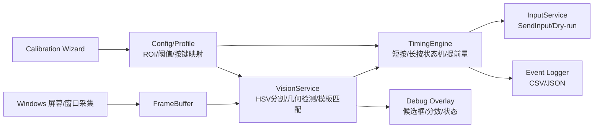
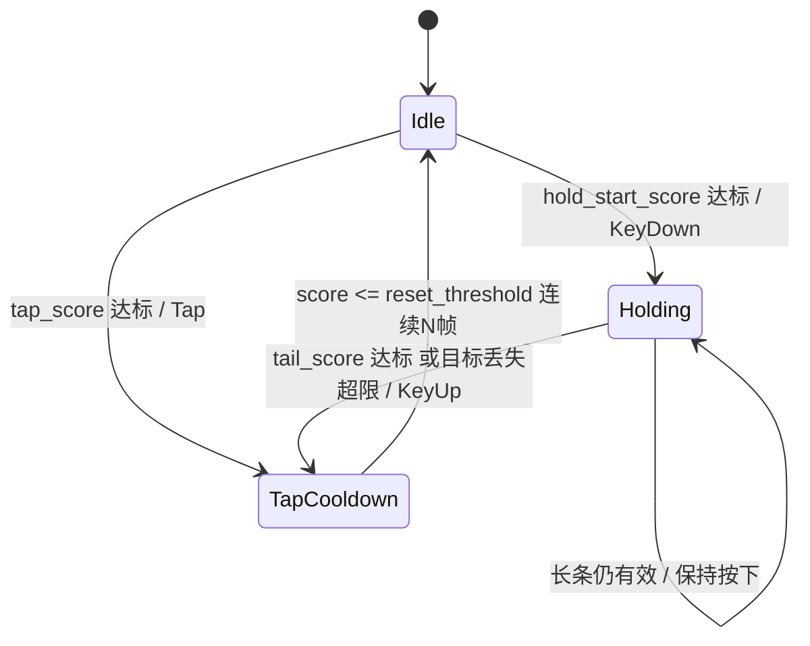

# 开发设计说明

## 1. 项目目标

开发一款本地 Windows 小工具，实时识别屏幕中出现的按键提示，并在最佳时机生成按下、短按、长按和弹起动作。该工具面向自有软件、训练工具、辅助功能或自动化测试场景。

核心目标：

- 不使用大内存模型，不依赖云端推理。
- 基于 OpenCV 取色、几何检测和轻量模板匹配完成识别。
- 支持普通短按和长按两种机制。
- 支持本地标定：ROI、颜色阈值、按键模板、延迟提前量。
- 能以调试浮层展示识别框、分数、状态机状态和事件流。

## 2. 视频分析结论

用户提供的视频为：

| 项目 | 结果 |
|---|---:|
| 分辨率 | 1280×694 |
| 帧率 | 30 FPS |
| 总帧数 | 3231 |
| 时长 | 约 107.7 秒 |
| 视频内单帧时间 | 约 33.3 ms |

视频中可观察到两类提示：

### 2.1 普通短按

视觉过程：

```text
字母圆出现
→ 外层亮圈/亮点靠近或与按钮重合
→ 圆心/外圈达到最佳重合
→ 按下后出现光效或评分反馈
```

最佳触发点不是提示刚出现，也不是评分文字出现，而是：

```text
外圈/亮点与字母按钮圆心或按钮外缘重合的瞬间
```

建议动作：

```text
KeyDown
等待 20–50 ms
KeyUp
```

默认配置采用 `35 ms` 的短按保持时间。

### 2.2 长按

视觉过程：

```text
底部字母圆 + 竖向长条 + 顶部端点圆出现
→ 起点按钮逐步高亮
→ 起点到达最佳点时按下
→ 按住期间持续跟踪长条/尾端
→ 尾端到达释放区域时弹起
→ 随后出现反馈光效
```

根据视频开头 A 长按片段的抽帧和亮度曲线，A 的起点大约在 1.10s 左右进入高亮并应按下，释放应发生在约 2.33s–2.37s，而不是等到完全消失后再释放。

长按最佳策略：

```text
起点字母圆高亮或头部到达判定线 → KeyDown
尾端/长条结束点到达释放位置 → KeyUp
```

### 2.3 识别重点

视频中提示主体颜色稳定，主要为金黄、橙黄、亮黄。大量背景光效为白色、紫色、蓝白色，因此不建议只用 RGB 平均亮度。推荐组合：

```text
HSV 金黄色分割
+ 圆形按钮几何检测
+ 外圈半径/圆心距离判断
+ 长条与尾端检测
+ 小范围字母模板匹配
+ 每个按键独立状态机
```

## 3. 技术选型

### 3.1 总体选型

| 层级 | 推荐方案 | 说明 |
|---|---|---|
| 屏幕采集 | Windows Graphics Capture | Windows 10/11 适配好，可采集窗口或显示器 |
| 高性能采集备选 | DXGI Desktop Duplication | 延迟低，适合高帧率全屏采集 |
| 视觉处理 | OpenCV / OpenCvSharp | HSV、轮廓、圆形、模板匹配都足够 |
| 字母识别 | 小模板匹配 / 灰度边缘匹配 | 不用 OCR，不用大模型 |
| 时机判断 | 状态机 + 高精度计时器 | 短按/长按独立处理 |
| 输入触发 | Win32 SendInput | 仅在授权场景使用；默认先 dry-run 测试 |
| 桌面 UI | WPF 或 WinUI 3 | 便于做调试面板、标定向导和 Overlay |
| 配置 | JSON profile | 易编辑、易版本化 |
| 日志 | CSV + JSONL | 调试、复盘和阈值优化 |

### 3.2 本机配置策略

用户本地只有 RTX 4070 Ti。该任务不需要大视觉模型，建议不要占用显卡运行大模型。

推荐策略：

```text
CPU OpenCV 实时处理
只裁剪提示区域 ROI
按需启用多线程：Capture线程、Vision线程、Timing线程、UI线程
GPU保留给目标应用本身
```

如果后期真的需要模型，最多使用一个极小 ONNX 分类器识别 A/S/W/D/Q/E/SPACE 的按钮图标，输入 48×48 或 64×64，显存占用可忽略。但第一版不需要。

## 4. 系统架构



### 4.1 模块划分

#### CaptureService

职责：

- 选择目标窗口或显示器。
- 获取带时间戳的帧。
- 支持全屏采集或 ROI 采集。
- 输出固定格式 `FramePacket`。

建议性能目标：

```text
采集帧率：60/120 FPS
采集到 Vision 入队延迟：< 5 ms
```

#### VisionService

职责：

- 对 `default_prompt_roi` 做裁剪。
- 转 HSV，生成金黄色 mask。
- 识别金色圆形按钮、外层圆环、长条和尾端圆。
- 对按钮中心小区域做模板匹配，得到 key 类型。
- 输出 `KeySignal`。

输出样例：

```json
{
  "time_ms": 16100.3,
  "key": "S",
  "type": "hold",
  "hold_start_score": 0.86,
  "hold_tail_score": 0.12,
  "predicted_ms_to_hit": 18.5,
  "bbox": [1088, 548, 78, 120]
}
```

#### TimingEngine

职责：

- 维护每个按键的独立状态机。
- 短按：在外圈/按钮重合时触发一次 Tap。
- 长按：按下后保持，尾端到达时 KeyUp。
- 加入连续帧确认、防抖、滞回、输入提前量。
- 输出 `KeyAction`。

#### InputService

职责：

- 接收 `KeyAction`。
- 在 dry-run 模式只记录日志，不真实发送按键。
- 授权场景下通过系统输入接口发送 KeyDown/KeyUp/Tap。
- 检查目标窗口是否仍然为用户选定窗口，避免误触其他窗口。

#### ConfigService

职责：

- 保存/读取 JSON profile。
- 管理多分辨率、多窗口配置。
- 管理模板文件路径、阈值、ROI、键位映射。

#### OverlayService

职责：

- 显示候选框、圆心、外圈、长条、尾端、分数。
- 显示状态机状态：Idle / Holding / Cooldown。
- 显示事件流、FPS、延迟估计。

## 5. 视觉算法设计

### 5.1 ROI 策略

正式工具不要全屏做完整视觉检测。流程应为：

```text
全帧捕获
→ 裁剪 default_prompt_roi
→ HSV 分割
→ 候选组件检测
→ 局部模板匹配
```

初始配置：

```json
"default_prompt_roi": [120, 60, 1040, 600]
```

这个 ROI 覆盖视频中大部分提示出现区域。正式用户应在标定向导中重新框选。

### 5.2 HSV 金黄色分割

初始阈值：

```json
"gold_hsv_lower": [13, 50, 70],
"gold_hsv_upper": [45, 255, 255],
"bright_gold_hsv_lower": [18, 80, 145],
"bright_gold_hsv_upper": [42, 255, 255]
```

处理建议：

```text
mask = inRange(HSV, lower, upper)
mask = open(mask, 3x3)
mask = close(mask, 5x5)
```

### 5.3 普通短按判断

普通短按推荐使用“外圈重合”而不是单纯亮度：

```text
button_center = 字母圆中心
button_radius = 字母圆半径
ring_center = 外层亮圈中心
ring_radius = 外层亮圈半径

center_delta = distance(button_center, ring_center)
radius_delta = abs(ring_radius - button_radius)
```

触发条件：

```text
center_delta <= tap_center_distance_tolerance_px
radius_delta <= tap_ring_radius_tolerance_px
且连续 N 帧满足
```

如果可以从运动轨迹估计速度，则使用预测提前量：

```text
predicted_ms_to_hit <= input_advance_ms
→ 立即触发
```

### 5.4 长按判断

长按分为起点和终点：

```text
起点：底部字母圆或头部到达判定位置
终点：尾端圆或长条末端到达释放位置
```

推荐分数：

```text
hold_start_score = 起点 ROI 内 bright_gold 像素比例 / 标定最大值
hold_tail_score = 尾端 ROI 内 bright_gold 像素比例 / 标定最大值
```

状态机：



默认阈值：

```json
"hold_down_score_threshold": 0.80,
"hold_up_tail_score_threshold": 0.74,
"reset_score_threshold": 0.38,
"consecutive_frames_confirm": 2
```

### 5.5 字母/图标识别

字母识别不是核心时机信号，但用于确定要触发哪个键。

推荐顺序：

1. 先用 HSV 和几何检测找到按钮圆。
2. 在按钮中心裁剪 40×40 或 48×48 的小图。
3. 转灰度，做 CLAHE 或局部对比度增强。
4. 与 `templates/letter_gray/` 或 `templates/letter_edge/` 做模板匹配。
5. 得分低于阈值时丢弃或进入人工确认。

不建议第一版使用 OCR，因为字母区域小、背景强光多、实时性要求高。

## 6. 时机与延迟补偿

从画面到真实输入存在链路延迟：

```text
采集延迟
+ 视觉处理延迟
+ 状态机决策延迟
+ 系统输入延迟
+ 目标窗口响应延迟
```

建议在 UI 中提供 `input_advance_ms`，初始值为 20–30ms。调试时通过事件日志观察偏早/偏晚，逐步微调。

性能目标：

| 阶段 | 目标 |
|---|---:|
| ROI 裁剪 + HSV | < 1.5 ms |
| 组件检测 + 模板匹配 | < 2.5 ms |
| 状态机 | < 0.2 ms |
| 总视觉处理 | < 4 ms |
| 采集帧率 | 60/120 FPS |

## 7. UI 和交互设计概览

UI 分三层：

1. 主控制台：选择窗口、启停、阈值、状态和事件流。
2. 标定向导：ROI、颜色、模板、延迟校准。
3. 调试浮层：叠加候选框、分数和状态机状态。

线框图文件：

```text
ui/wireframes/main_dashboard_wireframe.png
ui/wireframes/calibration_wizard_wireframe.png
ui/wireframes/debug_overlay_wireframe.png
```

## 8. 配置文件设计

配置文件采用 JSON。主配置样例见：

```text
config/default_profile.json
```

核心字段：

```json
{
  "screen": {
    "source_width": 1280,
    "source_height": 694,
    "capture_fps_target": 120,
    "default_prompt_roi": [120, 60, 1040, 600]
  },
  "vision": {
    "gold_hsv_lower": [13, 50, 70],
    "gold_hsv_upper": [45, 255, 255],
    "tap_ring_radius_tolerance_px": 5,
    "tap_center_distance_tolerance_px": 8
  },
  "timing": {
    "tap_down_duration_ms": 35,
    "input_advance_ms_default": 22,
    "hold_down_score_threshold": 0.80,
    "hold_up_tail_score_threshold": 0.74
  }
}
```

## 9. 测试策略

### 9.1 离线测试

- 使用录屏作为输入，跑离线检测。
- 输出事件 CSV。
- 对照抽帧手动标注，计算偏差。
- 保存 debug frame，检查误检和漏检。

### 9.2 在线测试

- 先 dry-run，只记录事件，不发送按键。
- 再在自有测试窗口中发送按键。
- 最后才连接目标授权窗口。

### 9.3 验收指标

| 指标 | 目标 |
|---|---:|
| 短按误差 | ≤ ±20 ms，按 120 FPS 采集估算 |
| 长按按下误差 | ≤ ±25 ms |
| 长按弹起误差 | ≤ ±25 ms |
| 误触发率 | < 1% 或可通过阈值调到可接受 |
| CPU 占用 | 单 ROI 目标 < 10%–15% |
| 显存占用 | 不依赖模型，近似 0 |

## 10. 风险与规避

| 风险 | 表现 | 规避 |
|---|---|---|
| 背景光效误检 | 白色/紫色技能光干扰 | HSV 金黄筛选 + ROI + 连续帧确认 |
| 同一提示重复触发 | 连续多帧都满足阈值 | 状态机 + Cooldown + reset 阈值 |
| 长按释放偏晚 | 等消失后才 KeyUp | 追踪尾端/长条末端，不看反馈文字 |
| 分辨率变化 | 模板失效 | 标定向导复采模板和 ROI |
| 延迟不稳定 | 早/晚按 | 事件日志 + input_advance_ms 校准 |
| 目标窗口不一致 | 输入打到错误窗口 | 前台窗口校验、热键急停、dry-run 默认 |

## 11. 交付建议

第一版不要追求“全自动识别所有情况”。建议先交付稳定可标定版本：

```text
固定 ROI
+ HSV 金色分割
+ 圆形/长条检测
+ 字母模板匹配
+ 每键状态机
+ 调试浮层
+ 本地配置保存
```

后续再加入自动 ROI 搜索、轨迹预测、模板自更新和异常帧回放。
